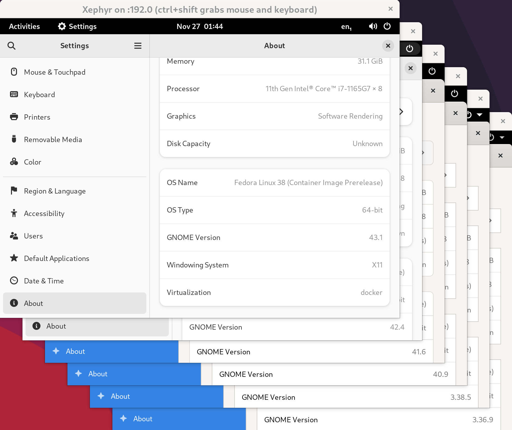

# x11docker-gnome

A collection of Dockerfiles for building images with different versions of GNOME.  These images can then be run with [x11docker](https://github.com/mviereck/x11docker).  Fedora images are used as a base, since versions of Fedora conveniently correspond to each stable version of GNOME.



`Makefile` allows building, pushing, pulling, and running of each image.  (Running in this case is just invoking `/bin/bash`---for starting with x11docker, see `run-gnome-desktop.sh`.)

The recommended workflow is as follows:

```sh
# Pull images from the GitHub Container Registry:
#   ghcr.io/jkitching/gnome-shell-XYZ
make pull gnome-shell-39 gnome-shell-40  # pull individual images
make pull all                            # pull all images

# Copy the run shell script template
cp run-gnome-desktop.sh.template run-gnome-desktop.sh
chmod +x run-gnome-desktop.sh

# Make modifications as necessary
vim run-gnome-desktop.sh

# Start GNOME container with x11docker
./run-gnome-desktop.sh gnome-shell-39
```

For more details on how it all works, check out this blog post: [GNOME development with x11docker containers](https://joelkitching.com/gnome-development-with-x11docker-containers/).

Images are rebuilt weekly on CI and published to `ghcr.io/jkitching/gnome-shell-XYZ`.

## Wayland, X11, and GNOME 49+

GNOME 49 removed the X11 session upstream, and 50+ is Wayland-only everywhere.  The `gnome-shell-49` and `gnome-shell-50` images are stock Wayland-only builds; `gnome-shell-49-x11` restores an X11 session on 49 via the [frantisekz/GNOME-X11 COPR](https://copr.fedorainfracloud.org/coprs/frantisekz/GNOME-X11/) for X-based x11docker modes---49 is the last version where that is possible.  (Fedora also publishes its official base images to quay.io as of 44, which is why `gnome-shell-50` builds from `quay.io/fedora/fedora:44`.)

## Headless / CI use

The images also work with no X server at all: `gnome-shell --headless --virtual-monitor 1920x1080` runs a full compositor whose output can be captured through `org.gnome.Mutter.ScreenCast` and PipeWire, and whose settings and extensions can be driven over D-Bus.  This makes the images useful as CI bases for testing GNOME Shell extensions against multiple GNOME versions---see [soft-brightness-plus](https://github.com/jkitching/soft-brightness-plus) (`test/e2e/`) for a working example.

## Included packages

* **gnome-terminal**
* **gnome-extensions-app** (separate package from GNOME 3.36 onward)
* **nautilus** for file browsing
* **xdg-user-dirs** creates directories required for taking screenshots
* **mesa-dri-drivers** and **mesa-libGL** for GPU acceleration
* **Xephyr** for displaying GDM login screen
* **xdotool** and **wmctrl** for programmatically controlling X11
* **iproute** for `ss` tool used to query TCP and other sockets (e.g. find open ports)
* **gnome-tour** is removed, because we don't want a tour
