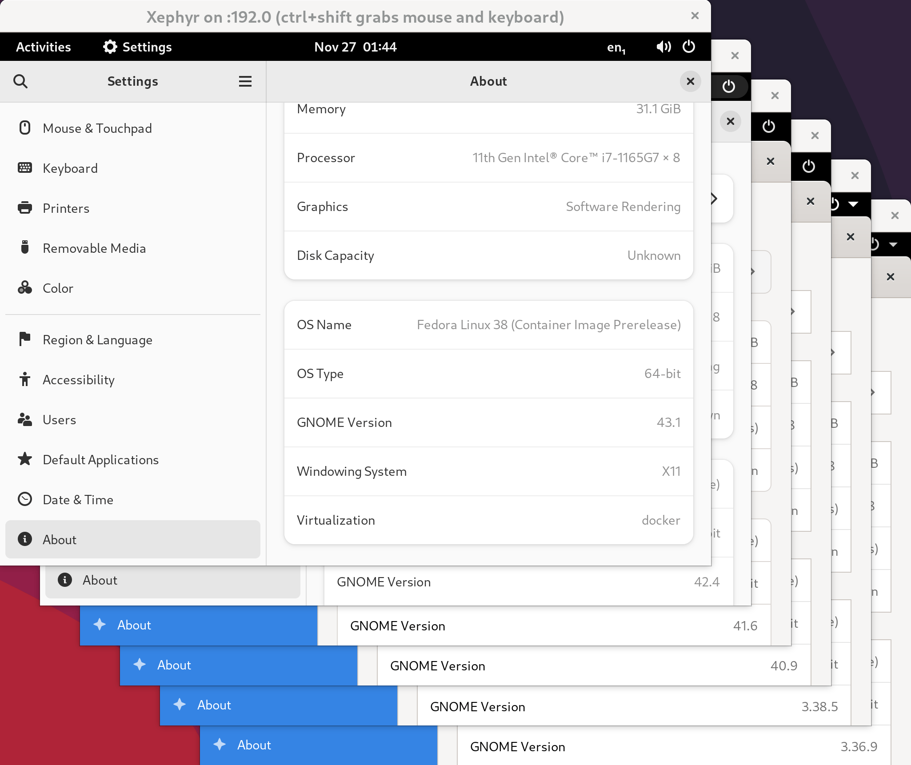

# x11docker-gnome

A collection of Dockerfiles for building images with different versions of GNOME.  These images can then be run with [x11docker](https://github.com/mviereck/x11docker).  Fedora images are used as a base, since versions of Fedora conveniently correspond to each stable version of GNOME.



`Makefile` allows building, pushing, pulling, and running of each image.  (Running in this case is just invoking `/bin/bash`---for starting with x11docker, see `run-gnome-shell.sh`.)

The recommended workflow is as follows:

```sh
# Pull images from Docker Hub:
#   docker.io/jkitching/gnome-shell-XYZ
make pull gnome-shell-39 gnome-shell-40  # pull individual images
make pull all                            # pull all images

# Copy the run shell script template
cp run-gnome-shell.sh.template run-gnome-shell.sh
chmod +x run-gnome-shell.sh

# Make modifications as necessary
vim run-gnome-shell.sh

# Start GNOME container with x11docker
./run-gnome-shell.sh gnome-shell-39
```

For more details on how it all works, check out this blog post: [GNOME development with x11docker containers](https://joelkitching.com/gnome-development-with-x11docker-containers/).
